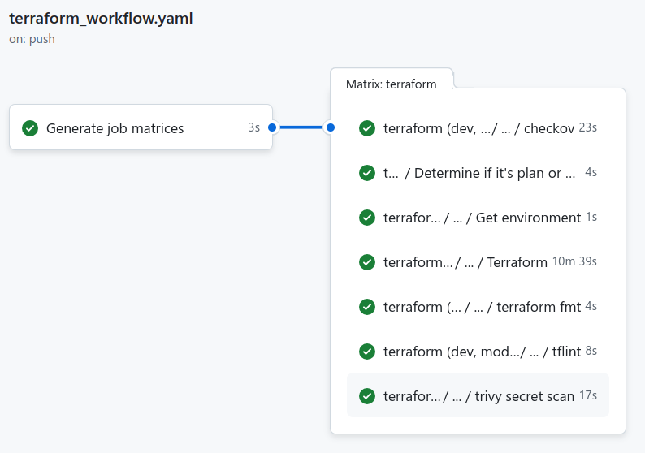

# ACN Horizon SDV

## Overview   
ACN Horizon SDV is designed to simplify the deployment and management of Android workloads on Google Kubernetes Engine clusters. By leveraging Infrastructure as Code (IaC) and GitOps, ensuring the cluster consistently matches the desired state, enabling scalable and efficient Android workload operations.

## Table of Contents
- [Overview](#overview)
- [Technologies](#technologies)
- [Project directories and files](#project-directories-and-files)
- [Exercise #1 - Prerequsites](#exercise-1---prerequsites)
- [Exercise #2 - Setup and Usage (WIP)](#exercise-2---setup-and-usage-wip)
   - [Exercise #2a - Setting up GCP IAM and Admin for Terraform Workflow](#exercise-2a---setting-up-gcp-iam-and-admin-for-terraform-workflow)
   - [Exercise #2b - GitHub Actions workflow](#exercise-2b---github-actions-workflow)
- [Exercise #3 - Verification](#exercise-3---verification)
   - [Exercise #3a - Running test builds](#exercise-3a---running-test-builds)
- [Exercise #4 - Troubleshooting](#exercise-4---troubleshooting)

## Technologies   
Technologies being used to provision the infrastructure along with the required applications for the GKE cluster.
* Google Cloud Platform - Cloud service provider for infrastructure provisioning.
* Terraform - IaC tool used to provision the infrastructure to maintain infrastructure consistency.
* Github - Source code management tool where infrastructure configuration, Kubernetes application manifests, workflows etc are stored.
* Github Actions - Continuous Integration (CI) platform used for automating the deployment process.
* Argo CD - Used to deploy Kubernetes application to match the desired state as in the GitHub repository configuration files.

## Project directories and files

The project is implemented in the following directories:

+ **.github/workflows** - Consists of GitHub Action workflows directing the operation of the CI build.
+ **gitops** - Kubernetes application manifests which will be used by Argo CD to deploy applications.
+ **terraform** - IaC configuration files to provision the infrastructure required for the GKE cluster.
+ **workloads** - Jenkins workflow scripts for the pipeline build jobs.

## Exercise #1 - Prerequsites
### GitHub
* Each team-member has GitHub account.
* Access to AGBG organization and Hackathon repository.
* Fork this repository to private GitHub area.
### Google Cloud Platform
* Configured GCP account / project.
* Each team-member able to update configuration in settings such as Secrets and Variables to customize it to use by the team.
* Google cloud project with the below APIs enabled:
   - IAM Service Account Credentials API
   - Kubernetes Engine API
   - Compute Engine API v1
   - Cloud Filestore API
   - Artifact Registry API
   - Cloud Storage API
* IAM Roles to be granted to the user or service accounts running Terraform scripts:
   - Compute Admin
   - Kubernetes Engine Admin
   - Artifact Registry Administrator
   - Cloud Filestore Editor
   - Storage Admin
### Terraform
* Access to edit the Terraform environment configuration files.
* IaC configuration files stored in GitHub repo.
* Infrastructure provisioned via CLI or GitHub Actions.

## Exercise #2 - Setup and Usage (WIP)
This section covers the steps to be followed for successfully provisioning the infrastructure along with other required tools and its configuration.  
Before getting started, make sure to fork this repository under your GitHub profile.

### Exercise #2a - Setting up GCP IAM and Admin for Terraform Workflow
The first step for successfully running the GitHub Actions workflow is to set the required Identity and Access Management (IAM) resources on GCP for Terraform to be able to provision the infrastructure.   
Below are the resources which are required to be configured:   
1. Workload Identity Federation Pool and Provider
2. Service Account and binding it to the Workload Identity Federation.
3. GitHub Secrets to be used by the Workflow.   
    
Lets get started, sign-in to your GCP Console and select the relevant project which you want to work on. Navigate to  IAM and Admin and follow the below mentioned steps.

#### Creating a Workload Identity Federation pool and provider
1. Under IAM and Admin, select Workload Identity Federation.
2. Click on CREATE POOL and provide all the necesarry details
   - Provide a relevant name to the pool.
   - Select OIDC as the provider.
   - Set the issuer to URL provided by GitHub for GitHub Actions. [Click here for more information](https://docs.github.com/en/actions/security-for-github-actions/security-hardening-your-deployments/configuring-openid-connect-in-google-cloud-platform#adding-a-google-cloud-workload-identity-provider)
   - Configure Provider attributes condition acccording to your requirements.
   - Under attribute conditions, Provide a CEL which grants access to your organisation and GitHub repository like `attribute.repository=='organisation_name/repository_name`
   - Click and save
3. Workload Identity Federation Pool and Provider has now been created successfully.

#### Creating a Service Account and Binding it to the Workload Identity Provider
1. Under IAM and Admin, navigate to Service Accounts and click on CREATE SERVICE ACCOUNT
2. Provide a relevant name for the Service Account.
3. Now, add a few roles which are required for this usecase as mentioned in the above Prerequisites section.
3. Click on save, your Service Account has now been created successfully.
4. To bind this Service Account to the Workload Identity Provider, open the Cloud Shell and run the below command by replacing details revelant to your project.   
     ``` 
     gcloud iam service-accounts add-iam-policy-binding "my-service-account@${PROJECT_ID}.iam.gserviceaccount.com" \
     --project="${PROJECT_ID}" \
     --role="roles/iam.workloadIdentityUser" \
     --member="principalSet://iam.googleapis.com/projects/1234567890/locations/global/workloadIdentityPools/my-pool/attribute.repository/my-org/my-repo"
     ```    
5. You can find the member details in the Workload Identity Federation pool which was created earlier. 
6. Refresh and confirm if the correct service account has been bound.

#### Creating GitHub Secrets to be used by the Workflow
1. In the repository settings, navigate to Secrets and variables.
2. Under Actions, add the required details such as Workload Identity Federation and Service Account.
3. Once the details have been set, it can be accessed as environment variable from the GitHub Actions workflow.
4. Update the workflow yaml file and set values for `workload_identity_provider` and `service_account`.
5. Now, run test workflows and check if the behaviour is as expected.   

Refer the following documentation for further details on the setup:   
* [Enabling keyless authentication from GitHub Actions](https://cloud.google.com/blog/products/identity-security/enabling-keyless-authentication-from-github-actions)
* [Configuring OpenID Connect in Google Cloud Platform](https://docs.github.com/en/actions/security-for-github-actions/security-hardening-your-deployments/configuring-openid-connect-in-google-cloud-platform)

### Exercise #2b - GitHub Actions workflow   
This section outlines the steps to trigger a GitHub Actions workflow. Before proceeding, it is recommended to fork this repository into your private GitHub account.   

The GitHub Actions Workflow has been configured to trigger if changes are either pushed to the `main` branch or any branch starting with `feature/` or `release/`. The workflow also gets trigger when pull requests are targeted toward the `main` branch. Provided, in both cases the changes are within `terraform/` directory.
   
> Note: Terraform apply workflows run only when changes are pushed or pull requests are targeted towards the `main` branch, otherwise Terraform plan only runs are triggered.

After forking the repository and configuring the required GCP IAM and Admin resources, as well as creating the necessary GitHub secrets, follow the steps below.   

#### Trigger workflow via new branch
1. Clone the repository to your machine locally by clicking on the  button, copy the HTTPS URL.
2. Run the below git command in your preferred directory to clone the repository   
   ``` 
   git clone <HTTPS_URL_OF_THE_REPOSITORY>
   ```
3. Create a new `feature/` or `release/` branch with the below command
   ```
   git checkout -b <feature/BRANCH_NAME>
   ```
4. Edit the Terraform configuration files under `terraform/` directory.
5. Add, commit and push the changes with below commands
   ```
   git add .
   git commit -m "commit message"
   git push origin <feature/BRANCH_NAME>
   ```

#### Trigger workflow by pull request
1. On the GitHub repository page, click on the Pull requests tab and click on 
2. Select `main` as the base branch and your `feature/` branch for compare.
3. After reviewing the changes, approve the pull request and confirm.
4. This process should have triggered a GitHub Actions workflow.

#### Confirm the workflow run
If the aboves steps have been performed successfully, you can now head to the GitHub repository and check if the GitHub Actions workflow run has been triggered and a successfull run should be as shown below   


## Exercise #3 - Verification
### Exercise #3a - Running test builds

## Exercise #4 - Troubleshooting


